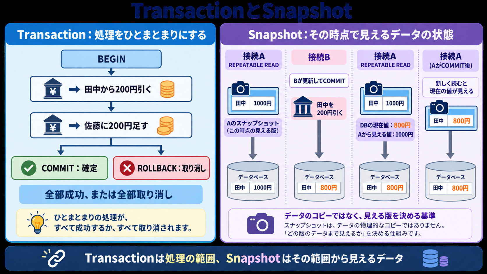
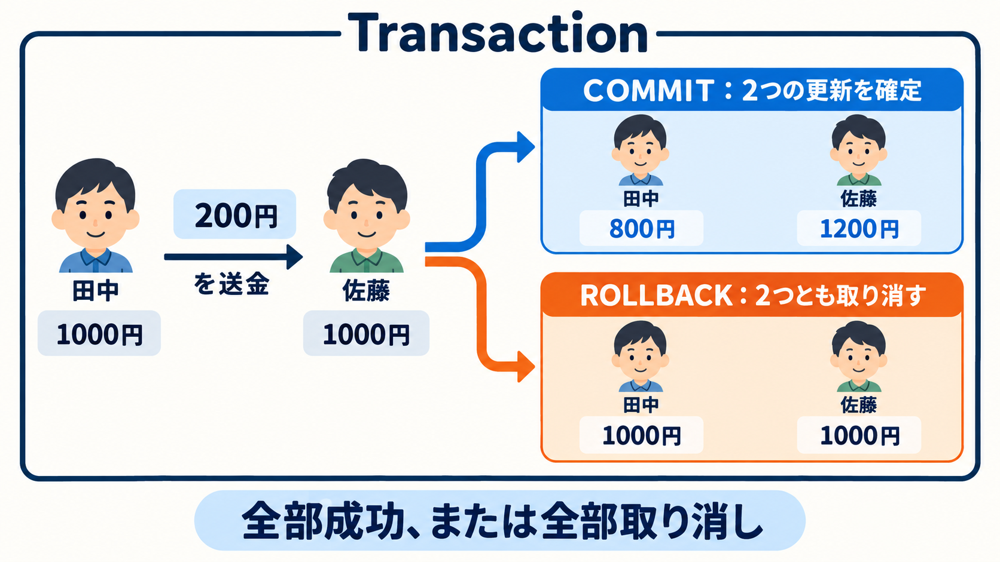
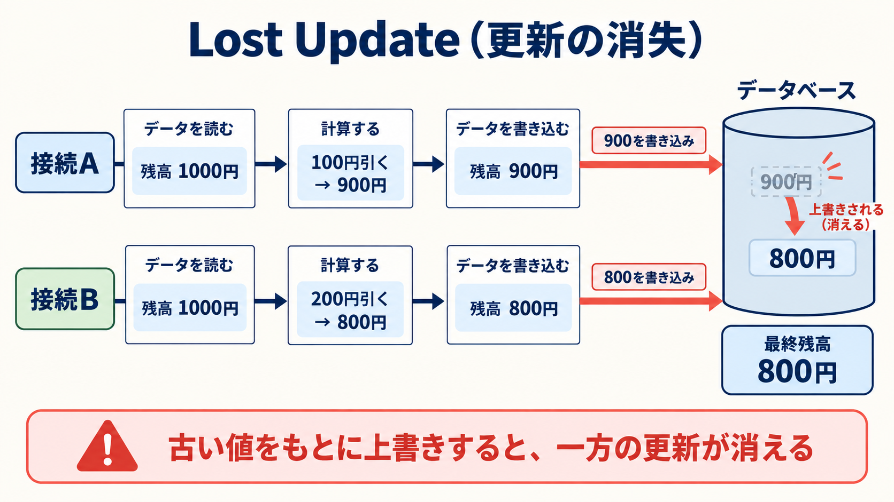
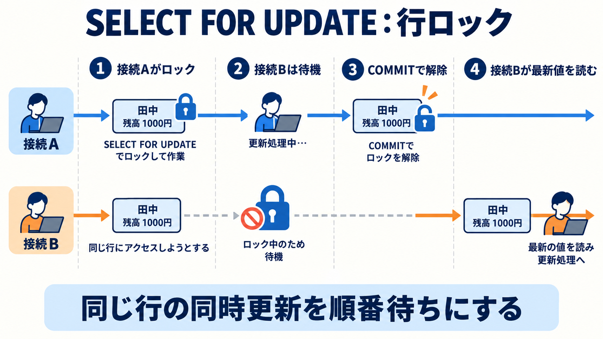
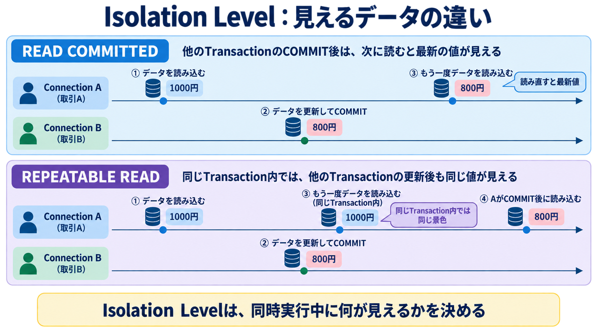
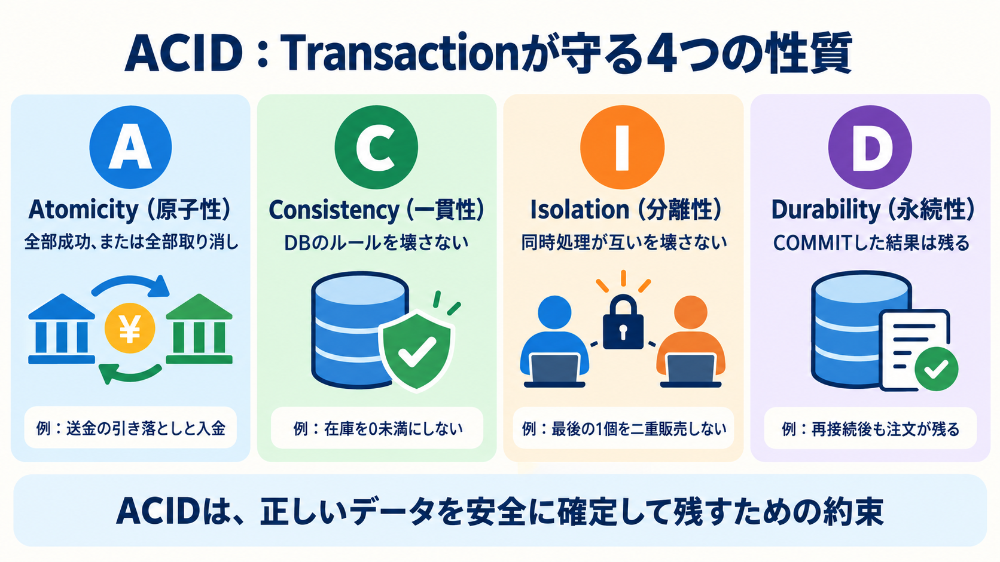
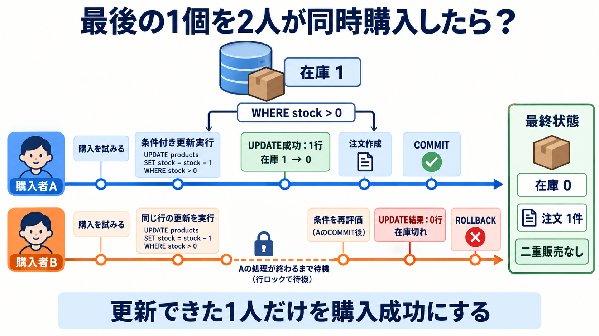

# Week 5: Transaction・Concurrency

複数のSQLを安全にまとめるTransactionと、同時実行時にデータを守るLock・Isolation Levelを、2つのpsql画面を使って観察します。

## ゴール

- `BEGIN`・`COMMIT`・`ROLLBACK`の役割を説明できる
- 同時更新でLost Updateが起きる理由を説明できる
- `SELECT ... FOR UPDATE`で更新対象を守れる
- Isolation Levelによって見えるデータが変わることを確認できる
- ACIDの4特性を実際の処理と結び付けて説明できる
- 最後の1個へ同時注文が来ても、1件だけ成功させられる

## 最初に見る図解



Transactionは処理を囲む範囲、Snapshotはその範囲から見えるデータの状態です。

## はじめ方

```bash
make db-up
make week5-setup
make week5-check
```

課題2以降はターミナルを2つ開き、両方で`make psql`を実行します。

## 課題

### 1. COMMITとROLLBACKを観察する



複数の更新が「全部成功」または「全部取り消し」になることを確認します。

```bash
make week5-1
```

### 2. Lost Updateを再現する



2つの接続が同じ残高を読み、それぞれ更新すると、一方の変更が消える流れを観察します。

[課題手順](exercises/02-lost-update.md)

### 3. 行ロックで更新を守る



`SELECT ... FOR UPDATE`で、先に更新しているTransactionが終わるまで後続処理を待たせます。

[課題手順](exercises/03-row-lock.md)

### 4. Isolation Levelを比較する



`READ COMMITTED`と`REPEATABLE READ`で、同じTransaction内の再読結果がどう変わるか比較します。

[課題手順](exercises/04-isolation-level.md)

### 5. ACIDを処理と結び付ける



送金・在庫・注文を例に、Atomicity・Consistency・Isolation・Durabilityが何を守るか確認します。

```bash
make week5-5
```

Durabilityは、`week5-5`のCOMMIT後にDBを再起動して確認します。`db-down`ではDocker volumeを削除しません。

```bash
make db-down
make db-up
make psql
```

```sql
select * from tx_products;
select * from tx_orders;
```

### 6. 最後の1個を2人が同時購入する



条件付き`UPDATE`を2接続から実行し、在庫1個に対して注文が1件だけ成功することを確認します。

[課題手順](exercises/06-last-item.md)

## 記録

実験前の予想と結果を[results.md](notes/results.md)へ記録してください。
