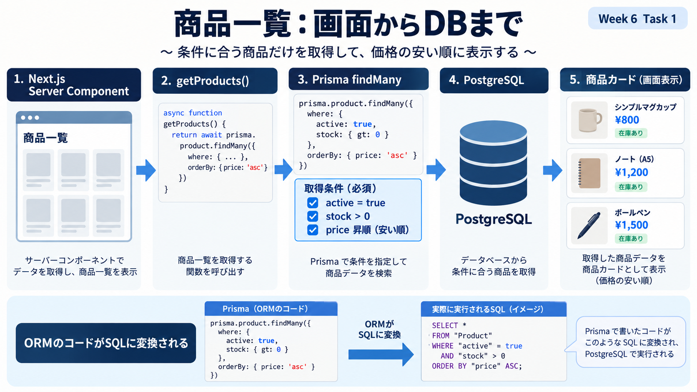
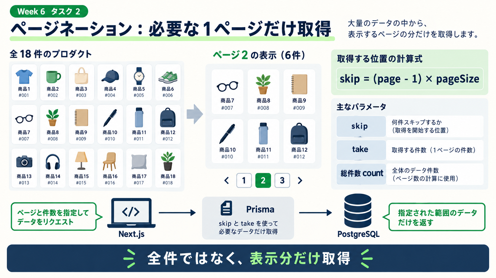
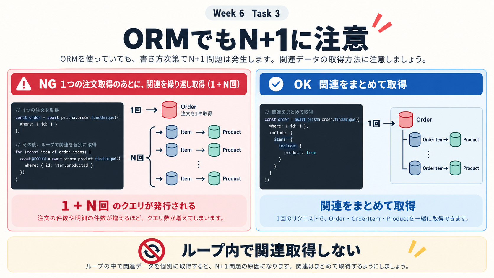
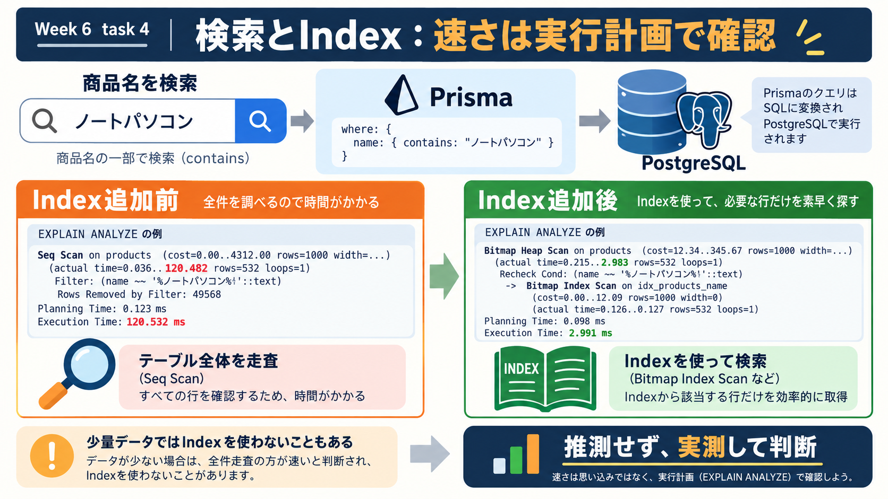
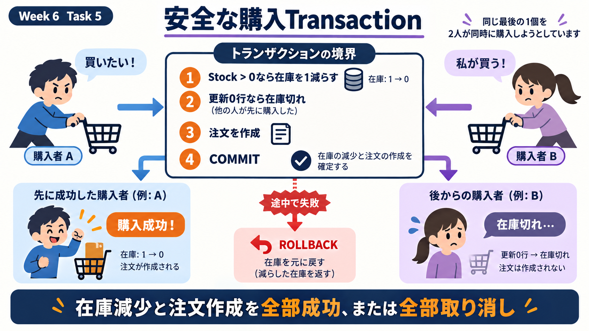

# Week 6: Next.js・Prisma・PostgreSQL総合演習

在庫付きの商品購入アプリを題材に、Week 2〜5で学んだ設計、Index、N+1、Transactionをアプリへ組み込みます。

## 今回、自分で書く部分

`app/src/lib/exercises.ts`にある5つのTODOを実装します。画面やDB接続の定型コードは用意済みです。

```text
1. 商品一覧取得
2. ページネーション
3. 関連データの一括取得
4. 検索
5. 在庫を守る購入Transaction
```

## はじめ方

```bash
make db-up
cd week6/app
cp .env.example .env
npm run db:generate
npm run db:push
npm run db:seed
npm run dev
```

## 課題

### 1. ORMで商品一覧を取得する



`getProducts()`を実装し、在庫のある商品を価格順で取得します。

[課題手順](exercises/01-product-list.md)

### 2. ページネーションを実装する



`getProductPage()`を実装し、`skip`と`take`で1ページ6件に分けます。

[課題手順](exercises/02-pagination.md)

### 3. N+1を避けて注文履歴を取得する



`getOrdersWithItems()`を実装し、注文・明細・商品をまとめて取得します。

[課題手順](exercises/03-orders.md)

### 4. 検索とIndexを比較する



`searchProducts()`を実装し、検索前後の実行計画を記録します。

[課題手順](exercises/04-search-index.md)

### 5. 購入Transactionを完成させる



`purchaseProduct()`を実装し、在庫減少と注文作成を同じTransactionに入れます。

[課題手順](exercises/05-purchase.md)

## 確認

```bash
cd week6/app
npm run check
```

結果と判断理由は[results.md](notes/results.md)へ記入します。
